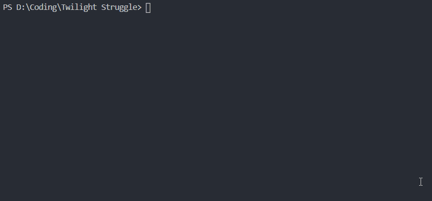

# twilight-struggle-py &middot; 

## Project outline

This project is a port of the Twilight Struggle board game. The goal of this project is to implement a reinforcement learning algorithm that would be a stronger computer player than the natively implemented one.

## Getting started

Clone the repo into your environment. You can play via the GUI or the CLI.

### GUI

Run `python app.py [-n]` in your command line. The `-n` command line argument stops a browser window from automatically opening. This version uses the already built Vue frontend. If you are working on the front-end development, you should need to run hot-reloading instead (instructions [below](https://github.com/glowsplint/twilight-struggle-py/tree/gui#how-to-start-the-development-server)).

Under the Game tab, `` Ctrl+` `` toggles the CLI console. `` ` `` toggles the navigation bar.

### CLI

Run `python twilight_ui.py` in your command line.

The following base commands are provided:

| Command                           | Description                                                                                                                      |
| --------------------------------- | -------------------------------------------------------------------------------------------------------------------------------- |
| `new`                             | Start a new game.                                                                                                                |
| `?`                               | Displays help text.                                                                                                              |
| `s`                               | Displays the overall game state.                                                                                                 |
| `m ?`                             | Shows help on move queries.                                                                                                      |
| `s ?`                             | Shows help on game state queries.                                                                                                |
| `c ?`                             | Shows help on card information queries.                                                                                          |
| `dbg ?`                           | Shows help on debugging.                                                                                                         |
| `rng on\|off`                     | Toggles automatic random number generation (rng off for debugging).                                                              |
| `commit on\|off`                  | Toggles commit prompts.                                                                                                          |
| `log on\|off`                     | Toggles game logging.                                                                                                            |
| `load <filename>`                 | Loads <filename> from the log directory.                                                                                         |
| `quit`                            | Exit the game.                                                                                                                   |
| `m`                               | Lists all possible moves, along with their respective enum.                                                                      |
| `m <name\|enum>`  | Makes the move with the name or with the enum. The name can be abbreviated to the first characters as long as it is unambiguous. |
| `m <m1 m2 m3 ...>`                | Makes multiple moves in order m1, m2, m3, ...                                                                                    |
| `s <eu\|as\|me\|af\|na\|sa>`      | Displays the scoring state and country data for the given region.                                                                |
| `c`                               | Display a list of cards in the current player's hand.                                                                            |
| `c <name\|ID#>`                   | Display information about the card with the given name or card index.                                                            |
| `c opp`                           | Returns the number cards in the opponent's hand.                                                                                 |
| `c dis`                           | Display a list of cards in the discard pile.                                                                                     |
| `c rem`                           | Display a list of removed cards.                                                                                                 |
| `c dec`                           | Returns the number of cards in the draw deck.                                                                                    |

### Dependencies

The main Python dependencies are [`flask`](https://github.com/pallets/flask) and [`flask-socketIO`](https://github.com/miguelgrinberg/Flask-SocketIO). Python dependencies are included at `./requirements.txt`.

The main external Vue dependencies are [`vue-socketIO-extended`](https://github.com/probil/vue-socket.io-extended/) and [`vuetify`](https://github.com/vuetifyjs/vuetify).

### How to start the development server

Run `vue ui` into `vue-cli-service serve` as the hot-reloading frontend development server, while concurrently running `python app.py -n` as the backend server running the game engine.

### To-do

1. Display current influence for every country
2. Display turn record + AR
3. Display space race
4. Display DEFCON status
5. Display Milops
6. Display VPs
7. Display current hand
