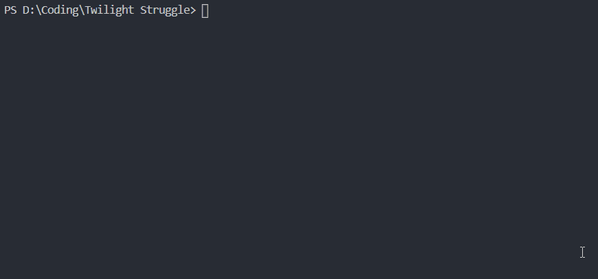

# twilight-struggle-py &middot; [](https://www.python.org/downloads/)

## Project outline

This project is a port of the Twilight Struggle board game. The goal of this project is to implement a reinforcement learning algorithm (PIMC + MCTS) that would be a stronger computer player than the natively implemented one.

## Getting started

### Prerequisites

- [Python 3.9+](https://www.python.org/downloads/) with [Pipenv](https://pipenv.pypa.io/)
- [Bun](https://bun.sh/) (for frontend development)

### Running locally

You need two terminals — one for the Python backend and one for the frontend dev server.

**1. Backend (Flask + Socket.IO)**

```bash
pipenv install
pipenv run python app.py -n
```

This starts the backend on `http://localhost:5000`. The `-n` flag prevents a browser window from auto-opening.

**2. Frontend (Vite dev server)**

```bash
cd frontend
bun install
bun run dev
```

This starts the Vite dev server on `http://localhost:8080`, which proxies `/socket.io` requests to the Flask backend.

Open **http://localhost:8080** in your browser.

### Production build (single server)

If you don't need hot-reloading, you can build the frontend and serve it directly from Flask:

```bash
cd frontend
bun install
bun run build
cd ..
pipenv run python app.py
```

Flask serves the built files from `frontend/dist/`. Open `http://localhost:5000`.

### CLI

You can also play without the GUI:

```bash
pipenv run python twilight_ui.py
```



## Keyboard shortcuts

| Shortcut            | Description              |
| ------------------- | ------------------------ |
| `` Ctrl+` ``        | Toggle CLI console       |
| `` ` ``             | Toggle navigation bar    |
| `Ctrl+P`            | Toggle side panel        |

## CLI commands

| Command                           | Description                                                                                                                      |
| --------------------------------- | -------------------------------------------------------------------------------------------------------------------------------- |
| `new`                             | Start a new game.                                                                                                                |
| `?`                               | Displays help text.                                                                                                              |
| `s`                               | Displays the overall game state.                                                                                                 |
| `m ?`                             | Shows help on move queries.                                                                                                      |
| `s ?`                             | Shows help on game state queries.                                                                                                |
| `c ?`                             | Shows help on card information queries.                                                                                          |
| `dbg ?`                           | Shows help on debugging.                                                                                                         |
| `rng on\|off`                     | Toggles automatic random number generation (rng off for debugging).                                                              |
| `commit on\|off`                  | Toggles commit prompts.                                                                                                          |
| `log on\|off`                     | Toggles game logging.                                                                                                            |
| `load <filename>`                 | Loads <filename> from the log directory.                                                                                         |
| `quit`                            | Exit the game.                                                                                                                   |
| `m`                               | Lists all possible moves, along with their respective enum.                                                                      |
| `m <name\|enum>`  | Makes the move with the name or with the enum. The name can be abbreviated to the first characters as long as it is unambiguous. |
| `m <m1 m2 m3 ...>`                | Makes multiple moves in order m1, m2, m3, ...                                                                                    |
| `s <eu\|as\|me\|af\|na\|sa>`      | Displays the scoring state and country data for the given region.                                                                |
| `c`                               | Display a list of cards in the current player's hand.                                                                            |
| `c <name\|ID#>`                   | Display information about the card with the given name or card index.                                                            |
| `c opp`                           | Returns the number cards in the opponent's hand.                                                                                 |
| `c dis`                           | Display a list of cards in the discard pile.                                                                                     |
| `c rem`                           | Display a list of removed cards.                                                                                                 |
| `c dec`                           | Returns the number of cards in the draw deck.                                                                                    |

## Tech stack

- **Backend:** Python 3.9+, Flask, Flask-SocketIO
- **Frontend:** Vue 3, TypeScript, Tailwind CSS 4, shadcn-vue, Pinia, Vite 7, Bun
- **AI:** PIMC + MCTS with PyTorch neural network (training pipeline included)

## Frontend development

The frontend uses TypeScript throughout. To type-check without building:

```bash
cd frontend
bun run type-check
```
